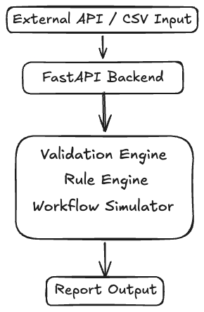
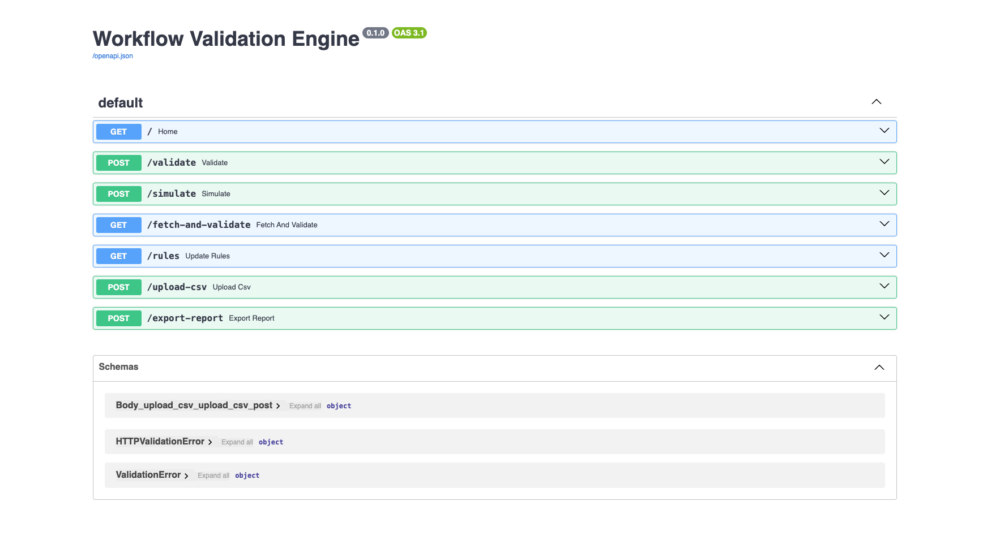
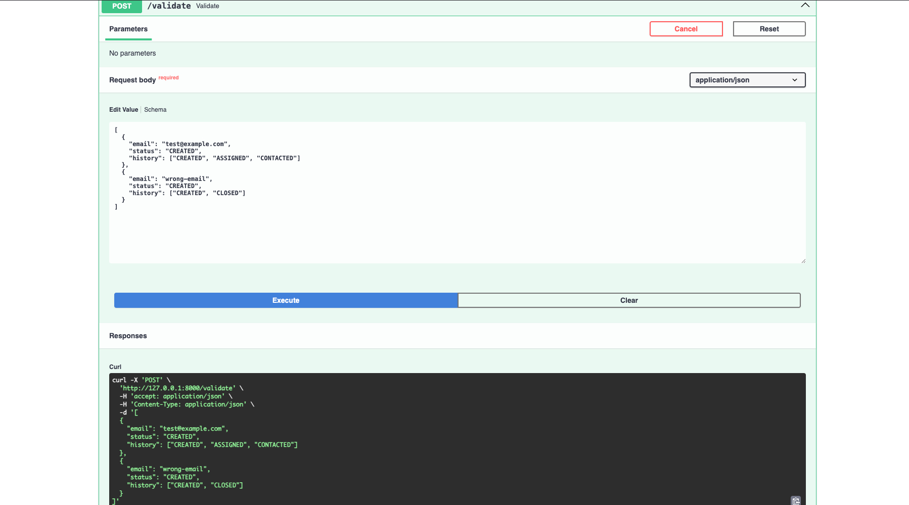
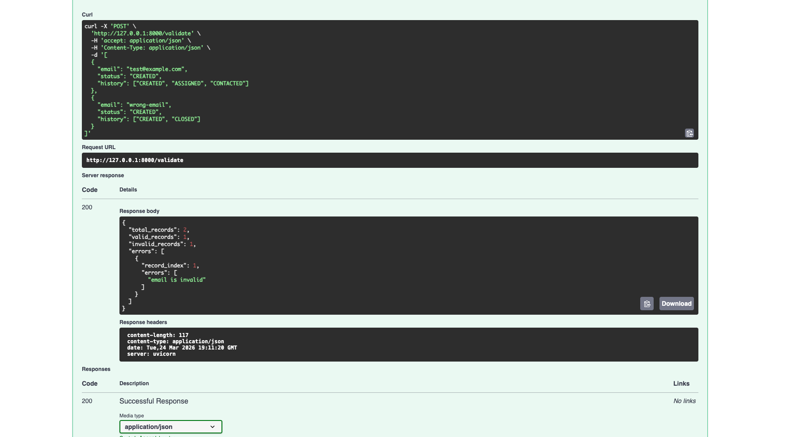

# Workflow Validation Engine

A scalable backend system for validating and simulating workflow data using configurable rules, external integrations, and REST APIs.

## 🚀 Features
- Rule-based validation engine
- Workflow simulation
- External API integration
- CSV upload support
- Report export (JSON)
- Asynchronous processing for scalability

## 🧠 Architecture
External API → Data Processing → Validation Engine → Workflow Simulation → Report Generation


## 📸 API Preview

### Swagger UI


### Validation Response




## 🛠 Tech Stack
- Python
- FastAPI
- AsyncIO

## 📌 API Endpoints
- POST /validate → Validate JSON data
- POST /simulate → Simulate workflow transitions
- GET /fetch-and-validate → Fetch external data and process
- POST /upload-csv → Upload CSV for validation
- POST /export-report → Download validation report
- POST /rules → Update validation rules dynamically

## ▶️ How to Run
```bash
pip install fastapi uvicorn python-multipart requests
uvicorn main:app --reload
```

## 📊 Sample Input 
```bash
[
  {
    "email": "test@example.com",
    "status": "CREATED",
    "history": ["CREATED", "ASSIGNED", "CONTACTED"]
  }
]
```

## 📈 Use Case 
This system is designed to validate large-scale workflow data, detect inconsistencies, simulate state transitions, and generate structured reports for debugging and analysis.